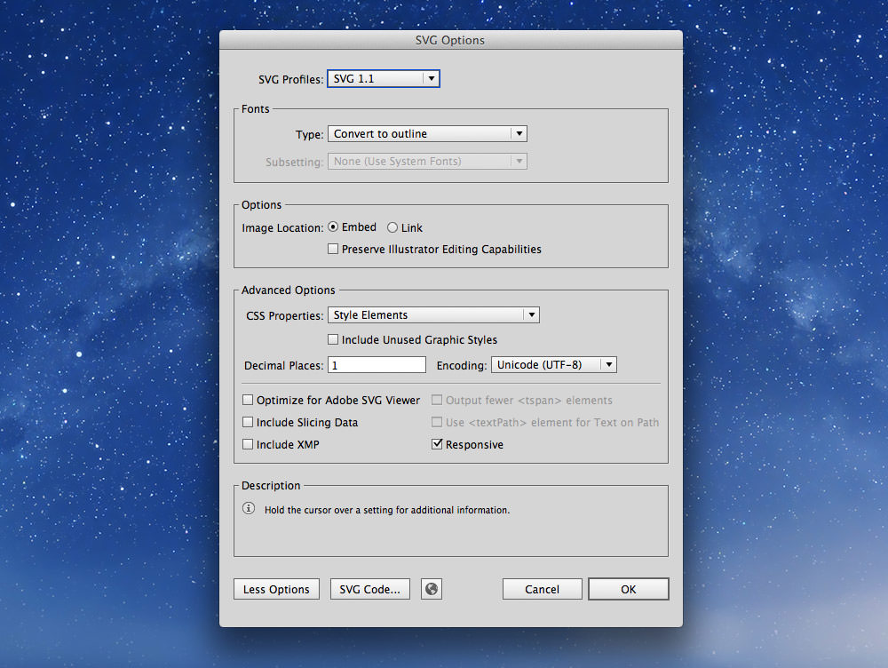

# Images

There are many considerations when adding images to your website.

### [▶ Video playlist for images](https://www.youtube.com/playlist?list=PLWjCJDeWfDdcK0q3kJyY12Wjrq0A9Ljph)

---

- [Image types](#image-types)
- [When to use an img tag over a background image](#foreground-vs-background-images)
- [Images for retina screens](#images-for-retina)
- [Speed of images](#speed-of-images)

---

## Image types

There are a few types of images used on the web:

3. **[JPGs](#-jpgs):** a raster format for photos and complex images
2. **[PNGs](#-pngs):** a raster format for logos and simple graphics
1. **[SVGs](#-svgs):** a vector format for logos and simple graphics
4. **[ICOs](#-favicons):** used only for favicons
5. **GIFs:** an older raster format for logos and simple graphics; generally used just for simple animations

### JPGs

JPG images should be used for photos and other complex graphics. They don’t work particularly well for text.

When preparing JPGs to use on your website save them from Photoshop with the “Save for Web” tool. This allows you to control the quality and monitor the filesize.

Our goal when using “Save for Web” is to increase the compression as much as possible while still retaining a good level of image quality.
By playing with the quality setting and watching the image for artifacts or blurring while also watching the size we can create a balance between filesize and quality.

*For standard photos I usually start around 65% quality and go up or down from there.*


There are a few other options to watch out for in the “Save for Web” dialogue:

- Check “Progressive”
- Un-check “Embed Color Profile”
- Check “Convert to sRGB”
- Set “Preview” to “Internet Standard RGB (No Color Management)”
- Set “Metadata” to “None”

**[Don’t forget to smush your JPGs afterwards.](#-image-smushing)**

### PNGs

PNG graphics should be used for logos, icons, and text. In many situations SVGs are better suited, but SVGs can’t create quite as many effects.

When preparing PNGs to use on your website save them from Photoshop with the “Save for Web” tool. This allows you to control the quality and monitor the filesize.

*You almost always want to use `PNG-24` because Photoshop’s implementation of PNG-8 is incorrect.*


There are a few other options to watch out for in the “Save for Web” dialogue:

- Check “Interlaced”
- Un-check “Embed Color Profile”
- Check “Convert to sRGB”
- Set “Preview” to “Internet Standard RGB (No Color Management)”
- Set “Metadata” to “None”

**[Don’t forget to smush your PNGs afterwards.](#-image-smushing)**

### SVGs

SVG graphics are a great replacement for PNGs—for logos and simple graphics.
SVGs are a vector graphic format, like Adobe Illustrator “ai” files, but made for the browser and the web.
You can open them up in your text editor—because they are just XML—and edit them.

- Create your graphic in Illustrator then go to `File > Save a Copy`
- Choose `SVG` as the type
- In the dialogue that pops up, select `SVG 1.1`
- Under the “Fonts” section choose `Convert to Outline` for the “Type”
- Un-check “Preserve Illustrator Editing Capabilities”
- Press the `More Options` button and fill in a couple more options
	- “CSS Properties” — `Style Elements`
	- “Decimal Places” — 1
	- Make sure “Responsive” is checked



**[Don’t forget to smush your SVGs afterwards.](#-image-smushing)**

**Links**

- No SVG fallback to PNG for HTML `` — <https://gist.github.com/3855802>
- No SVG fallback to PNG for CSS background-image — <https://gist.github.com/3856091>

### Favicons

Favicons are a great way to include your brand in the tab of the browser.
They also often show up when you bookmark sites.
It’s suggested to put the favicon right into the root of your website, `http://domain.ca/favicon.ico`, because browsers will look for it there by default.
If, for some reason, you can’t put it there you can use the `<link>` tag to include it.

```html
<!-- This is optional; it’s better to put the icon at the root of your domain. -->
<link href="img/favicon.ico" rel="shortcut icon">
```

Some devices have their own favicon-like graphics, e.g. Apple Touch Icon, Opera Speed Dial Icon, Windows 8 Tile Icon.

#### Dimensions

- **favicon.ico**—16×16, 32×32
- **apple-touch-icon.png**—256×256
- **opera-icon.png**—256×160
- **msapplication-icon.png**—144×144 (transparent)

#### Platform specific meta tags

```html
<link href="/opera-icon.png" rel="icon" type="image/png">
<meta name="application-name" content="Your Site Name">
<meta name="msapplication-TileImage" content="/msapplication-icon.png">
<meta name="msapplication-TileColor" content="#ef0303">
```

**Links**

- **[Icon Slate](http://www.kodlian.com/apps/icon-slate)**
- [Treehouse: How to Make a Favicon](http://blog.teamtreehouse.com/how-to-make-a-favicon)
- [X Icon Editor](http://xiconeditor.com/)
- Apple Touch Icons: <http://mathiasbynens.be/notes/touch-icons>
- Windows 8 Tile Icons: <http://hicksdesign.co.uk/journal/pinned-sites-in-windows-8>
- Opera Speed Dial Icons: <http://dev.opera.com/articles/view/opera-speed-dial-enhancements/>
- [Favicon Cheat Sheet](https://github.com/audreyr/favicon-cheat-sheet)

---

## Speed of images

The most important design consideration for websites is speed.
There are a couple things you can do to your images to help speed up your website.

1. Choose the correct image format in Photoshop’s `Save for Web`—and compress it well
2. Use CSS sprites to reduce how many images get downloaded
3. Smush (recompress) all images using an app like ImageOptim

### Image smushing

Many images contain extra meta information in their files that can be stripped out without compromising the image.
Smushing will reduce the size of images without reducing their quality.

*All images should be exported from Photoshop with “Save for Web”, then run through a smusher.*

- `PNGs` — should be run through ImageOptim and ImageAlpha
- `JPGs` — should be run through ImageOptim and JPEGmini
- `SVGs` — should be run through SVGO

**Links**

- **[ImageOptim](http://imageoptim.com/)** — compresses all raster images without compromising quality
- **[ImageAlpha](http://pngmini.com/)** — compresses PNGs by allowing you to reduce the number of colours in the image
- **[JPEGmini](http://www.jpegmini.com/)** — losslessly compresses JPG photos
- **[SVGO-GUI](https://github.com/svg/svgo-gui)** — removes extraneous code and whitespace from SVGs to save on filesize
- [Smush.it](http://www.smushit.com/)

---

## Videos

1. [Images: alt attributes](https://www.youtube.com/watch?v=xcWwcTRS79s&list=PLWjCJDeWfDdcK0q3kJyY12Wjrq0A9Ljph&index=1)
1. [Images: figures](https://www.youtube.com/watch?v=X-uIMl8V6kg&list=PLWjCJDeWfDdcK0q3kJyY12Wjrq0A9Ljph&index=2)
1. [Images: SVG](https://www.youtube.com/watch?v=Q_saQXuejQc&list=PLWjCJDeWfDdcK0q3kJyY12Wjrq0A9Ljph&index=3)
2. [Images: favicons](https://www.youtube.com/watch?v=G407yUWeU40&list=PLWjCJDeWfDdcK0q3kJyY12Wjrq0A9Ljph&index=4)
7. [Images: smushing](https://www.youtube.com/watch?v=3nYcq3CPSe8&list=PLWjCJDeWfDdcK0q3kJyY12Wjrq0A9Ljph&index=9)

---

## Setting up Photoshop for the web

- [The Mysterious Save For Web Color Shift](http://viget.com/inspire/the-mysterious-save-for-web-color-shift)
