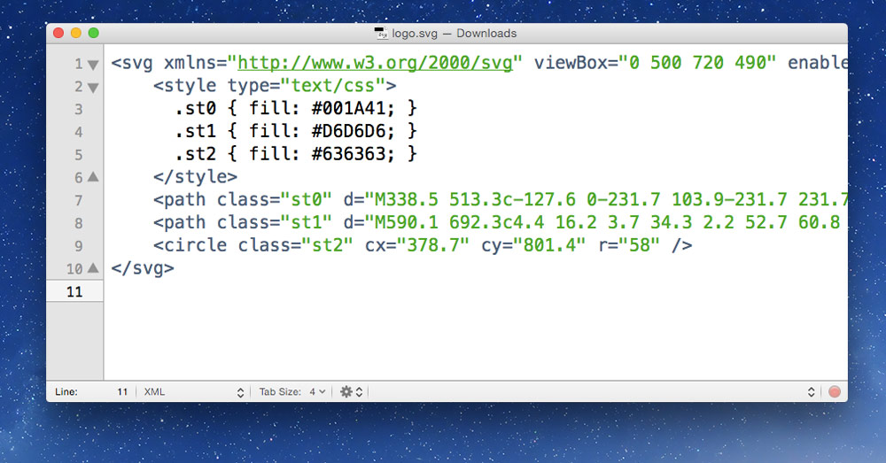
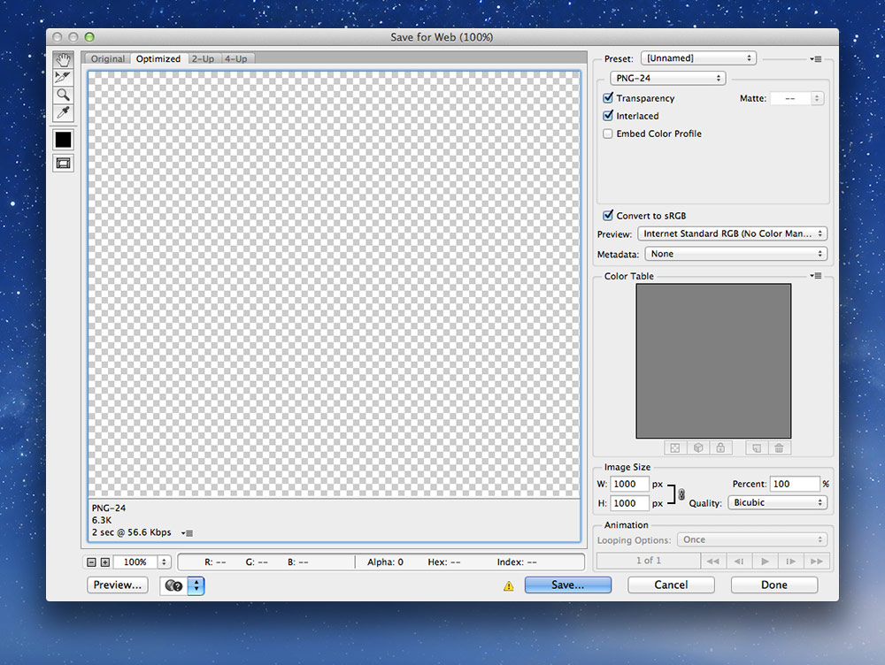

# Image formats

There are a few types of images that can be used on the web: JPGs, PNGs, SVGs, favicons, and GIFs.

### [▶ Video playlist for image formats](https://www.youtube.com/watch?v=W3o5CE4AUnc&index=1&list=PLWjCJDeWfDdcK0q3kJyY12Wjrq0A9Ljph)

---

- [SVG](#svg)
	- [SVGs are code](#svgs-are-code)
- [JPG](#jpg)
- [PNG](#png)
- [Favicons](#favicons)
	- [Dimensions](#dimensions)
	- [Platform specific meta tags](platform-specific-meta-tags)
- [GIF](#gif)
- [Speed of images](#speed-of-images)
	- [Image smushing](#image-smushing)
	- [JPG optimization techniques](#jpg-optimization-techniques)
- [Videos](#videos)
- [Links](#links)

---

## SVG

Scalable Vector Graphics, SVG, are a vector image format specifically for the web—targeted at non-complex graphics.

SVG graphics can be created in many vector applications, like [Illustrator](http://www.adobe.com/ca/products/illustrator.html) and [Sketch](http://bohemiancoding.com/sketch/).


- Create your graphic in Illustrator then go to `File > Save a Copy`
- Choose `SVG` as the type
- In the dialogue that pops up, select `SVG 1.1`
- Under the “Fonts” section choose `Convert to Outline` for the “Type”
- “Image Location” should be set to `Link`
- Un-check “Preserve Illustrator Editing Capabilities”
- Press the `More Options` button and fill in a couple more options
	- “CSS Properties” — `Style Elements`
	- Un-check “Include Unused Graphic Styles”
	- “Decimal Places” — 1
	- Make sure “Responsive” is **not** checked (for better browser support)

**[Don’t forget to smush your SVGs afterwards.](#image-smushing)**

### SVGs are code

You can open them up in your text editor—because they are just XML—and edit them.



#### [☛ Check out the tutorials on SVG effects]()

**Links**

- No SVG fallback to PNG for HTML `` — <https://gist.github.com/3855802>
- No SVG fallback to PNG for CSS background-image — <https://gist.github.com/3856091>

---

## JPG

JPG images should be used for photos and other complex graphics with many colours. They don’t work particularly well for text.

When preparing JPGs to use on your website save them from Photoshop with the “Save for Web” tool. This allows you to control the quality and monitor the file size.

Our goal when using “Save for Web” is to increase the compression as much as possible while still retaining a good level of image quality. By playing with the quality setting and watching the image for artifacts or blurring while also watching the size we can create a balance between file size and quality.

*For standard photos I usually start around 65% quality and go up or down from there.*


There are a few other options to watch out for in the “Save for Web” dialogue:

- Check “Progressive”
- Un-check “Embed Color Profile”
- Check “Convert to sRGB”
- Set “Preview” to “Internet Standard RGB (No Color Management)”
- Set “Metadata” to “None”

**[Don’t forget to smush your JPGs afterwards.](#image-smushing)**

---

## PNG

Portable Network Graphics, PNGs, should be used for logos, icons, and text. In many situations SVGs are better suited, but SVGs can’t create some effects.

When preparing PNGs to use on your website save them from Photoshop with the “Save for Web” tool. This allows you to control the quality and monitor the file size.

*You almost always want to use `PNG-24` because Photoshop’s implementation of PNG-8 is incorrect—but it’s always worth trying PNG-8 to see if it produces a good result.*



There are a few other options to watch out for in the “Save for Web” dialogue:

- Check “Interlaced”
- Un-check “Embed Color Profile”
- Check “Convert to sRGB”
- Set “Preview” to “Internet Standard RGB (No Color Management)”
- Set “Metadata” to “None”

**[Don’t forget to smush your PNGs afterwards.](#image-smushing)**

---

## Favicons

Favicons are a great way to include your brand in the tab of the browser. They also often show up when you bookmark sites.

It’s suggested to put the favicon right into the root of your website, `http://domain.ca/favicon.ico`, because browsers will look for it there by default.

If, for some reason, you can’t put it there you can use the `<link>` tag to include it.

```html
<!-- This is optional; it’s better to put the icon at the root of your domain. -->
<link href="img/favicon.ico" rel="shortcut icon">
```

### Dimensions

- **favicon.ico** — 16×16, 32×32, 48×48
- **favicon-152.png** — 152×152
- **favicon-144.png** — 144×144 (transparent)

### Platform specific meta tags

```html
<meta name="application-name" content="Your Site Name">
<link rel="apple-touch-icon-precomposed" href="/favicon-152.png">
<meta name="msapplication-TileImage" content="/favicon-144.png">
<meta name="msapplication-TileColor" content="#ef0303">
```

**Links**

- **[Icon Slate](http://www.kodlian.com/apps/icon-slate)**
- **[Favicon Cheat Sheet](https://github.com/audreyr/favicon-cheat-sheet)**
- [Treehouse: How to Make a Favicon](http://blog.teamtreehouse.com/how-to-make-a-favicon)
- [X Icon Editor](http://xiconeditor.com/)
- Apple Touch Icons: <http://mathiasbynens.be/notes/touch-icons>
- Windows 8 Tile Icons: <http://hicksdesign.co.uk/journal/pinned-sites-in-windows-8>

---

## GIF

The Graphics Interchange Format, or GIF, is an older image format for the web. For many static images SVG or PNG are much better suited—**but GIFs can be animated.**

Photoshop has the ability to animate GIFs using the “Timeline” window.

---

## Speed of images

The most important design consideration for websites is speed.

There are a couple things you can do to your images to help speed up your website.

1. Choose the correct image format in Photoshop’s `Save for Web`—and compress it well
2. Use CSS sprites to reduce how many images get downloaded
3. Smush (recompress) all images using an app like ImageOptim

### Image smushing

Many images contain extra meta information in their files that can be stripped out without compromising the image.
Smushing will reduce the size of images without reducing their quality.

*All images should be exported from Photoshop with “Save for Web”, then run through a smusher.*

- `PNGs` & `JPGs` — should be run through ImageOptim
- `SVGs` — should be run through SVGO-GUI

### JPG optimization techniques

- Reduce the noise and complexity of the image
- Blur unimportant areas

**Links**

- **[ImageOptim](http://imageoptim.com/)** — compresses all raster images without compromising quality
- **[SVGO-GUI](https://github.com/svg/svgo-gui)** — removes extraneous code and whitespace from SVGs to save on filesize
- [Smush.it](http://www.smushit.com/)
- [ImageAlpha](http://pngmini.com/) — compresses PNGs by allowing you to reduce the number of colours in the image

---

## Videos

1. [Image formats: creating SVGs](https://www.youtube.com/watch?v=W3o5CE4AUnc&list=PLWjCJDeWfDdcK0q3kJyY12Wjrq0A9Ljph&index=1)
2. [Image formats: exporting SVGs using artboards](https://www.youtube.com/watch?v=IKonBvbgVaw&list=PLWjCJDeWfDdcK0q3kJyY12Wjrq0A9Ljph&index=2)
3. [Image formats: saving JPGs](https://www.youtube.com/watch?v=xTAgM3tZ72A&list=PLWjCJDeWfDdcK0q3kJyY12Wjrq0A9Ljph&index=3)
4. [Image formats: saving PNGs](https://www.youtube.com/watch?v=NOduAdEq3-8&list=PLWjCJDeWfDdcK0q3kJyY12Wjrq0A9Ljph&index=4)
5. [Image formats: smushing](https://www.youtube.com/watch?v=O9_L2jIr_nA&list=PLWjCJDeWfDdcK0q3kJyY12Wjrq0A9Ljph&index=5)
6. [Image formats: favicons](https://www.youtube.com/watch?v=G407yUWeU40&list=PLWjCJDeWfDdcK0q3kJyY12Wjrq0A9Ljph&index=6)

## Links

- **[Image Formats: The Nerdy Parts](http://larahogan.me/images/)**
- [The Mysterious Save For Web Color Shift](http://viget.com/inspire/the-mysterious-save-for-web-color-shift)
