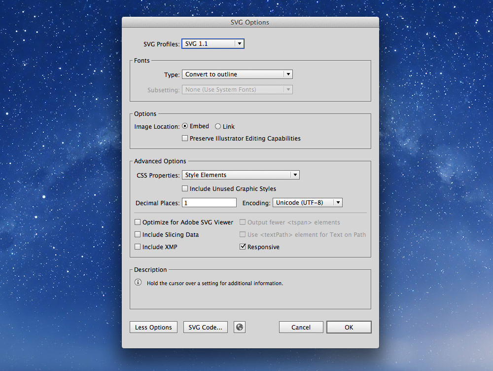

# Images

There are many considerations when adding images to your website.

- [Image types](#image-types)
- [When to use an img tag over a background image]()
- [Images for retina screens](#images-for-retina)
- [Speed of images](#speed-of-images)

### [☛ Videos for images](https://www.youtube.com/playlist?list=PLWjCJDeWfDdcK0q3kJyY12Wjrq0A9Ljph)

---

## Image types

There are a few types of images used on the web:

3. **[JPGs](#-jpgs):** a raster format for photos and complex images
2. **[PNGs](#-pngs):** a raster format for logos and simple graphics
1. **[SVGs](#-svgs):** a vector format for logos and simple graphics
4. **[ICOs](#-favicons):** used only for favicons
5. **GIFs:** an older raster format for logos and simple graphics; generally used just for simple animations

### ☛ JPGs

JPG images should be used for photos and other complex graphics. They don’t work particularly well for text.

When preparing JPGs to use on your website save them from Photoshop with the “Save for Web” tool. This allows you to control the quality and monitor the filesize.

Our goal when using “Save for Web” is to increase the compression as much as possible while still retaining a good level of image quality.
By playing with the quality setting and watching the image for artifacts or blurring while also watching the size we can create a balance between filesize and quality.

*For standard photos I usually start around 65% quality and go up or down from there.*


There are a few other options to watch out for in the “Save for Web” dialogue:

- Check “Progressive”
- Un-check “Embed Color Profile”
- Set “Preview” to “Internet Standard RGB (No Color Management)”
- Set “Metadata” to “None”
- Check “Convert to sRGB”

**[Don’t forget to smush your JPGs afterwards.](#image-smushing)**

### ☛ PNGs

PNG graphics should be used for logos, icons, and text. In many situations SVGs are better suited, but SVGs can’t create quite as many effects.

When preparing PNGs to use on your website save them from Photoshop with the “Save for Web” tool. This allows you to control the quality and monitor the filesize.

*You almost always want to use `PNG-24` because Photoshop’s implementation of PNG-8 is incorrect.


There are a few other options to watch out for in the “Save for Web” dialogue:

- Check “Interlaced”
- Un-check “Embed Color Profile”
- Set “Preview” to “Internet Standard RGB (No Color Management)”
- Set “Metadata” to “None”
- Check “Convert to sRGB”

**[Don’t forget to smush your PNGs afterwards.](#-image-smushing)**

### ☛ SVGs

SVG graphics are a great replacement for PNGs—for logos and simple graphics.
SVGs are a vector graphic format, like Adobe Illustrator “ai” files, but made for the browser and the web.
You can open them up in your text editor—because they are just XML—and edit them.

- Create your graphic in Illustrator then go to `File > Save a Copy`
- Choose `SVG` as the type
- In the dialogue that pops up, select “SVG 1.1”
- Under the “Fonts” section choose `Convert to Outline` for the “Type”
- Un-check “Preserve Illustrator Editing Capabilities”
- Press the `More Options` button and fill in a couple more options
	- “CSS Properties” — `Style Elements`
	- “Decimal Places” — 2 (or usually 1 works)



**[Don’t forget to smush your SVGs afterwards.](#image-smushing)**

**Videos**

- [Images: SVG](https://www.youtube.com/watch?v=TfgZpgQMBEg&list=PLWjCJDeWfDdcK0q3kJyY12Wjrq0A9Ljph&index=1)

**Links**

- No SVG fallback to PNG for HTML `` — <https://gist.github.com/3855802>
- No SVG fallback to PNG for CSS background-image — <https://gist.github.com/3856091>

### ☛ Favicons

Favicons are a great way to include your brand in the tab of the browser.
They also often show up when you bookmark sites.
It’s suggested to put the favicon right into the root of your website, `http://domain.ca/favicon.ico`, because browsers will look for it there by default.
If, for some reason, you can’t put it there you can use the `<link>` tag to include it.

```html
<link rel="shortcut icon" href="img/favicon.ico">
```

Some devices have their own favicon-like graphics, e.g. Apple Touch Icon, Opera Speed Dial Icon, Windows 8 Tile Icon.

#### Dimensions

- **favicon.ico**—16×16, 32×32
- **apple-touch-icon.png**—256×256
- **opera-icon.png**—256×160
- **msapplication-icon.png**—144×144 (transparent)

#### Platform specific meta tags

```html
<link rel="icon" type="image/png" href="/opera-icon.png">
<meta name="application-name" content="Your Site Name">
<meta name="msapplication-TileImage" content="/msapplication-icon.png">
<meta name="msapplication-TileColor" content="#ef0303">
```

**Videos**

- [Images: favicons](https://www.youtube.com/watch?v=G407yUWeU40&list=PLWjCJDeWfDdcK0q3kJyY12Wjrq0A9Ljph&index=2)

**Links**

- [Icon Slate](http://www.kodlian.com/apps/icon-slate)
- [X Icon Editor](http://xiconeditor.com/)
- Apple Touch Icons: <http://mathiasbynens.be/notes/touch-icons>
- Windows 8 Tile Icons: <http://hicksdesign.co.uk/journal/pinned-sites-in-windows-8>
- Opera Speed Dial Icons: <http://dev.opera.com/articles/view/opera-speed-dial-enhancements/>
- [Favicon Cheat Sheet](https://github.com/audreyr/favicon-cheat-sheet)

---

## Image replacement

Image replacement is a technique to replace text on the page with an image in an accessible manner.
The technique is useful when you cannot produce the text style you’d like in CSS.

```html
<h1 class="masthead ir">Rainbows</h1>
```

```css
.ir {
  /* The technique pushes the text off the side of the element and chops it off */
  overflow: hidden;
  text-indent: 100%;
  white-space: nowrap;
}

.masthead {
  background: transparent url("rainbow.jpg") no-repeat left top;
  /* Put a min-height on the element equal to the image’s height */
  min-height: 100px;
}
```

**Videos**

- [Images: image replacement](https://www.youtube.com/watch?v=U7B9-UtEK7w&list=PLWjCJDeWfDdcK0q3kJyY12Wjrq0A9Ljph&index=3)

**Links**

- [Zeldman: New Image Replacement](http://www.zeldman.com/2012/03/01/replacing-the-9999px-hack-new-image-replacement/)

---

## Images for retina

With many screens now becoming high resolution it’s time to start preparing our images to support the new technology.

There are a few techniques we can use for hi-res screens:

1. **CSS:** can it be done purely with CSS (and it’s practical)? Do it that way.
2. **SVG:** is it a logo, or an icon, or a simple vector-like graphic? Use SVG.
3. **Two PNGs:** is the SVG not producing the desired output? Use a low-res and a hi-res PNGs.
4. **Compressive JPGs:** For photos, use a double-size JPG, with lower quality.
	This may not work in every situation, so use your discretion.

### ☛ Two PNGs

Sometimes SVG graphics don’t produce the result you want for icons yet you still want to provide crisp graphics for hi-res screens.
Using two differently sized PNGs and a media query for detecting hi-res screens is another option.

**Videos**

- [Images: multi-resolution PNGs](https://www.youtube.com/watch?v=Q91vXeF0mpU&list=PLWjCJDeWfDdcK0q3kJyY12Wjrq0A9Ljph&index=4)

**Links**

- Retina media queries: <https://gist.github.com/3855791>
- [Media Query Asset Downloading Results](http://timkadlec.com/2012/04/media-query-asset-downloading-results/)

### ☛ Compressive JPGs

Compressive JPGs are a technique for supplying hi-resolution photos while reducing the download size.
The major downside of this technique is that the images can become very memory intensive.

- Using the original source file, make the image double its width on your website
- Use `Save For Web` to compress the image to a JPG with a quality of somewhere around 25%–35%

**Videos**

- [Images: compressive JPEGs](https://www.youtube.com/watch?v=3SzWx4_mL7A&list=PLWjCJDeWfDdcK0q3kJyY12Wjrq0A9Ljph&index=5)

**Links**

- [Retina Revolution Compressive JPEGs](http://blog.netvlies.nl/design-interactie/retina-revolution/)
- [RWD Image Compression](http://filamentgroup.com/lab/rwd_img_compression/)

---

## Speed of images

The most important design consideration for websites is speed.
There are a couple things you can do to your images to help speed up your website.

1. Choose the correct image format in Photoshop’s `Save for Web`—and compress it well
2. Use CSS sprites to reduce how many images get downloaded
3. Smush (recompress) all images using an app like ImageOptim

### ☛ CSS sprites

Combine your images into a single file in Photoshop and using `background-position` show only a single part of the image at a time.

**Videos**

- [Images: CSS sprites](https://www.youtube.com/watch?v=nm8D1tTs5bY&list=PLWjCJDeWfDdcK0q3kJyY12Wjrq0A9Ljph&index=6)

### ☛ Image smushing

Many images contain extra meta information in their files that can be stripped out without compromising the image.
Smushing will reduce the size of images without reducing their quality.

*All images should be exported from Photoshop with “Save for Web”, then run through a smusher.*

- `PNGs` — should be run through ImageOptim and ImageAlpha
- `JPGs` — should be run through ImageOptim and JPEGmini
- `SVGs` — should be run through SVGO

**Videos**

- [Images: smushing](https://www.youtube.com/watch?v=3nYcq3CPSe8&list=PLWjCJDeWfDdcK0q3kJyY12Wjrq0A9Ljph&index=7)

**Links**

- **[ImageOptim](http://imageoptim.com/)**
- **[ImageAlpha](http://pngmini.com/)**
- **[JPEGmini](http://www.jpegmini.com/)**
- **[SVGO-GUI](https://github.com/svg/svgo-gui)**
- [Smush.it](http://www.smushit.com/)

---

## Videos

1. [Images: SVG](https://www.youtube.com/watch?v=TfgZpgQMBEg&list=PLWjCJDeWfDdcK0q3kJyY12Wjrq0A9Ljph&index=1)
2. [Images: favicons](https://www.youtube.com/watch?v=G407yUWeU40&list=PLWjCJDeWfDdcK0q3kJyY12Wjrq0A9Ljph&index=2)
3. [Images: image replacement](https://www.youtube.com/watch?v=U7B9-UtEK7w&list=PLWjCJDeWfDdcK0q3kJyY12Wjrq0A9Ljph&index=3)
4. [Images: multi-resolution PNGs](https://www.youtube.com/watch?v=Q91vXeF0mpU&list=PLWjCJDeWfDdcK0q3kJyY12Wjrq0A9Ljph&index=4)
5. [Images: compressive JPEGs](https://www.youtube.com/watch?v=3SzWx4_mL7A&list=PLWjCJDeWfDdcK0q3kJyY12Wjrq0A9Ljph&index=5)
6. [Images: CSS sprites](https://www.youtube.com/watch?v=nm8D1tTs5bY&list=PLWjCJDeWfDdcK0q3kJyY12Wjrq0A9Ljph&index=6)
7. [Images: smushing](https://www.youtube.com/watch?v=3nYcq3CPSe8&list=PLWjCJDeWfDdcK0q3kJyY12Wjrq0A9Ljph&index=7)
