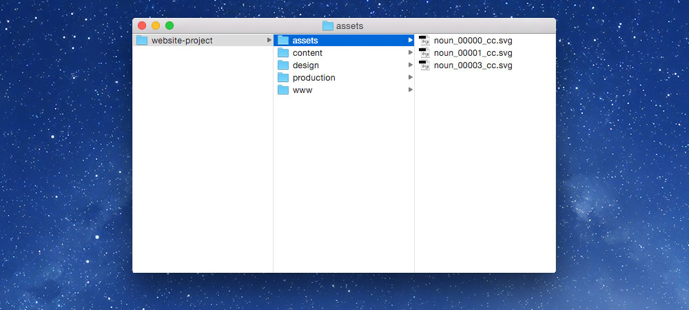
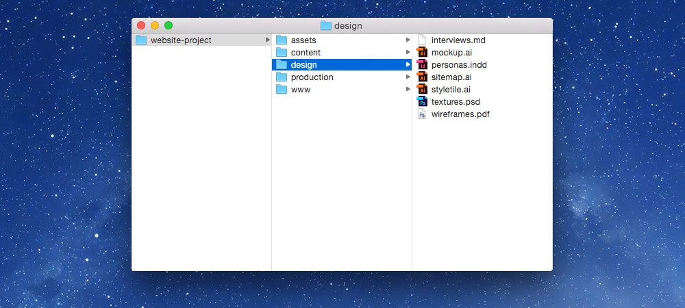
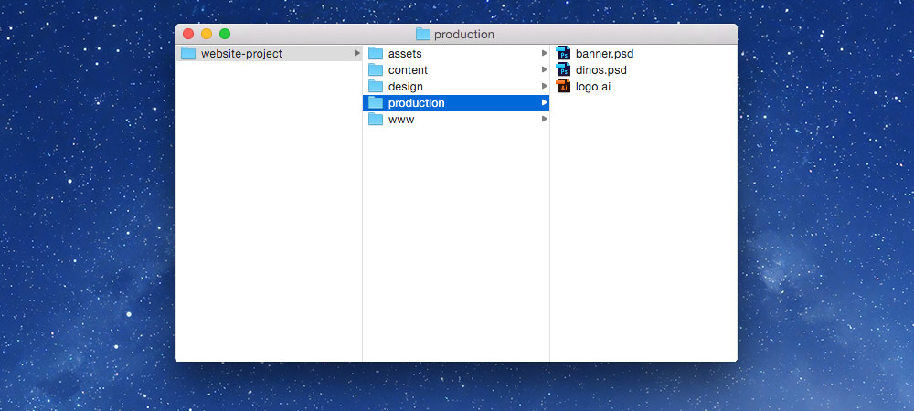
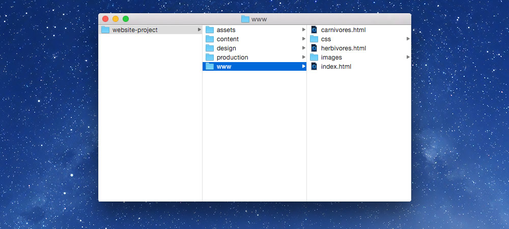
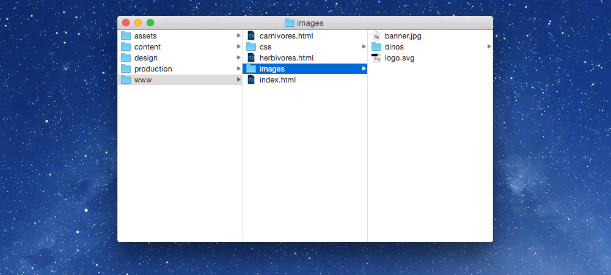

# Organizing website files

Below is a way to organize your website & production files in a logical manner that’s appropriate for GitHub.

### [▶ Video playlist for organization](https://www.youtube.com/watch?v=_bn7bYpuNcQ&list=PLWjCJDeWfDdfJhlnFDLwCu4GZ_2lfuMMx)

---

- [File & folder organization](#file--folder-organization)
	- [assets](#assets)
	- [design](#design)
	- [production](#production)
	- [www](#www)
		- [www/images](#www-images)
- [What goes on/off GitHub](#what-goes-onoff-github)
- [Version control for design & production files](#version-control-for-design--production-files)
	- [Benefits of Dropbox](#benefits-of-dropbox)
	- [Benefits of InVision](#benefits-of-invision)
- [Tips for production files](#tips-for-production-files)
- [Videos](#videos)

---

## File organization

It’s best to separate the production and design files from the compressed output files that are used on the website.

Design and production files should not go inside the GitHub repository, but instead it’s best to put them in Dropbox.

- Git & GitHub don’t support large binary files so we can’t put any Creative Suite files there
- Putting the Creative Suite files into [Dropbox](#benefits-of-dropbox) & [InVision](#benefits-of-invision) have lots of benefits
- The Creative Suite files should always be kept in-case they need to be changed at a later time
- The files used in a website should be [compressed and smushed for the best performance](../performance/)—and therefore cannot be edited

1. Create a folder for the project, named descriptively
2. Create the following folders within it:
	- `design` — for mockups, wireframes, sitemaps, etc.
	- `production` — for the files extracted from the mockups and used in production of the website
	- `sourced` — for photos, files from clients, content, etc.

The website code and image files can be put in a few different places:

- Either in the Dropbox folder too
- Or another folder on your computer where all your code is collected

*Putting the Git repository in Dropbox has nice backup potential (but not necessary if the Git repo is synced to a service like GitHub)—but Dropbox and Git can sometimes conflict.*

---

## What goes on/off GitHub

**Files ON GitHub:**

- Anything text-based: html, css, Javascript, SVG, plain text, Markdown
- Compressed images: JPGs, PNGs, GIFs

**Files NOT ON GitHub:**

- Adobe Creative Suite files: AI, PSD, INDD, PDF
- Font files: OTF, TTF, WOFF
- Compressed files: ZIP, GZ
- Video & audio: MP4, OGV, M4A, MP3, OGG

---

## Version control for design & production files

### Benefits of Dropbox

Storing your mockups, design files, and production files in Dropbox has a few benefits:

1. You can easily share those files with other members of your team
2. You get automatic version control and backups lasting 30 days (unless you upgrade)
3. You can see the files on any device & they can be shared with many online tools

---

## Tips for production files

- Make patterns as minimal as possible: only one of the repeated pieces is necessary
- If there are lots of images that are nearly identical, specifically dimension and theme-wise, put them in one PSD
- SVGs should be saved as AI files; PNGs and JPGs as PSD files
- Make border-image files as small as possible
- [Don’t forget to compress and smush your images](../image-formats/#image-smushing)

---

## Videos

- [Organizing web files](https://www.youtube.com/watch?v=V3xDoXeq0ic&list=PLWjCJDeWfDdfJhlnFDLwCu4GZ_2lfuMMx&index=1)
