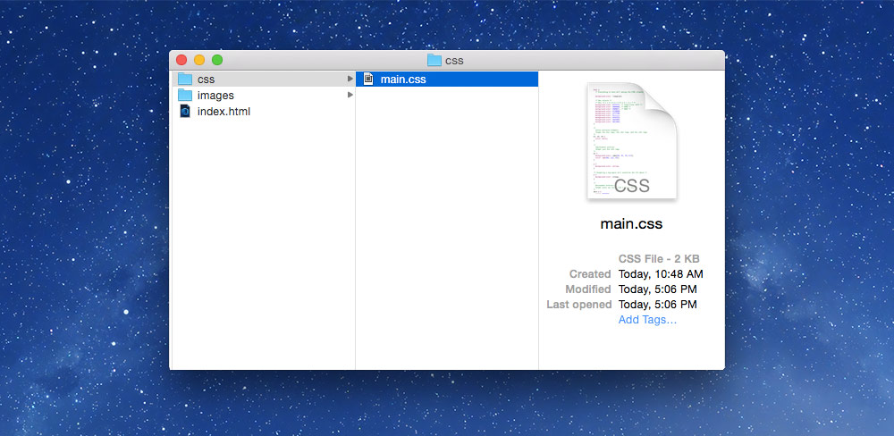
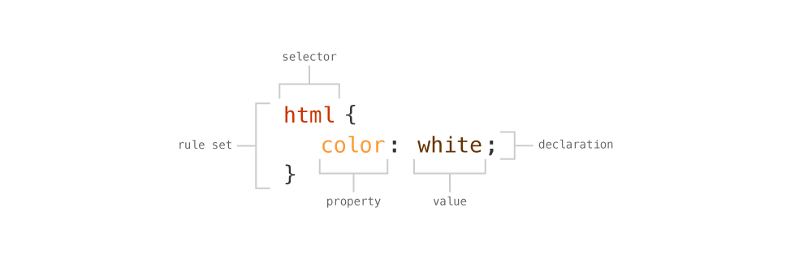

# Using CSS

Creating and attaching a Cascading Style Sheets to your HTML and basic targeting and styling of websites.

### [▶ Video playlist for using CSS]()

---

- [Creating a CSS file]()
	- [Attaching a CSS file]()
- [Anatomy of CSS]()
- [Targeting things in HTML]()
	- [Targeting by HTML element]()
	- [Targeting multiple elements at once]()
	- [Targeting child elements]()
	- [Naming and classes]()
	- [Styling by number]()
	- [CSS colours]()
- [Videos]()

---

## Creating a CSS file

A CSS file isn’t anything special, it’s just a basic plain-text file like HTML.

In your code editor, just create a new file, and save it with the extension `.css`. Name the file whatever you want—following our naming conventions.

*It’s always a good idea to put your CSS into a `css` folder, for better organization.*



### Attaching a CSS file

After creating and saving the CSS file, we just need to link the CSS and HTML files together so the browser can find them.

In the `head` of the HTML document, add the `link` line:

```html
<head>
	⋮
	<link href="css/main.css" rel="stylesheet">
</head>
```

The `link` element is used to associate different types of documents to your HTML, primarily CSS, but also blog feeds, help documents, licenses, etc.

- `href` — this attribute is used to point to location of the CSS file
- `rel` — this attribute is used to define this item as a `stylesheet`

*The path to the CSS file must point into the correct folder.*

## Anatomy of CSS

The parts of CSS are very simple, but allow complex designs. To style something in CSS you first need to target the element then apply some new design styles.



- `rule set` — a grouping of CSS styles that design a certain set of elements
- `declaration` — a single line of CSS that adds a design element
- `selector` — the targeted item in your HTML document to design
- `property` — the design item to style
- `value` — the style to change the item

## Targeting things in HTML

### Targeting by HTML element

### Targeting multiple elements at once

### Targeting child elements

### Naming and classes

### Styling by number

### CSS colours

---

## Videos
